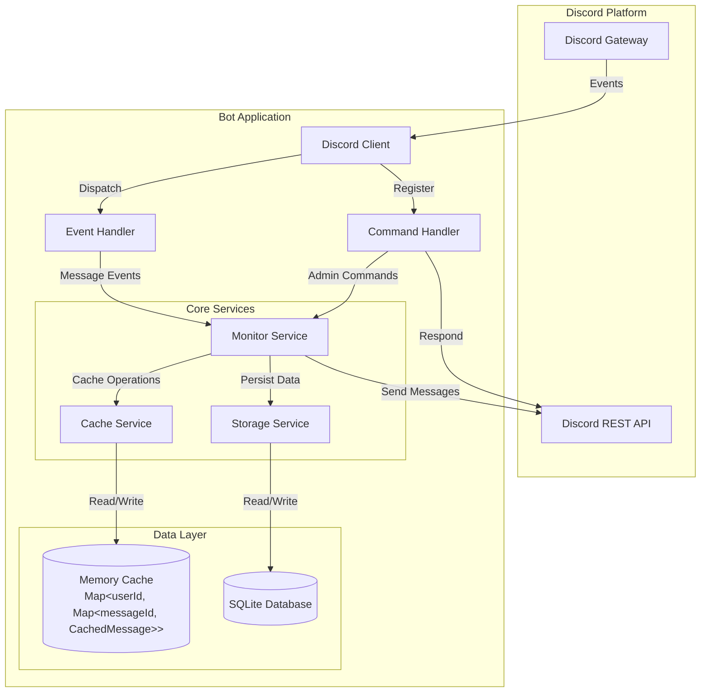
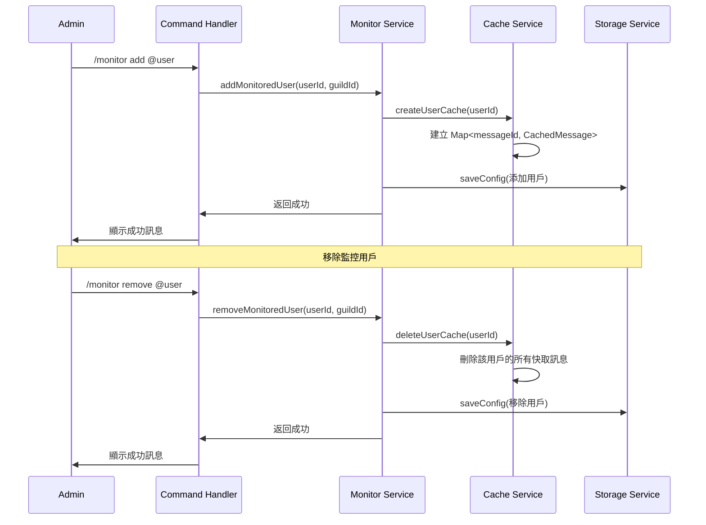
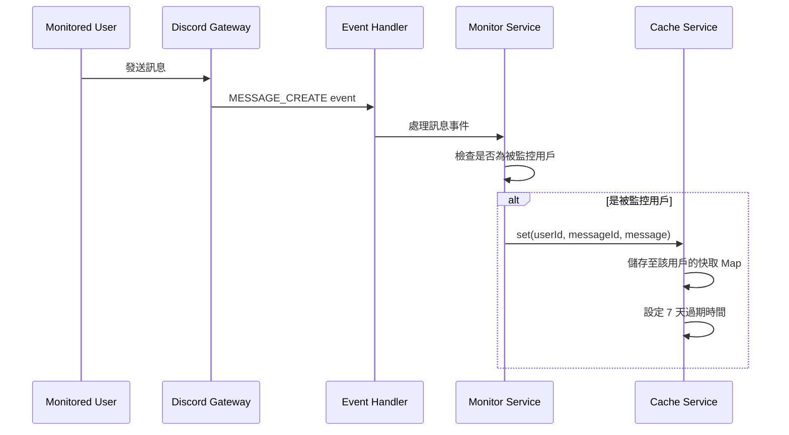
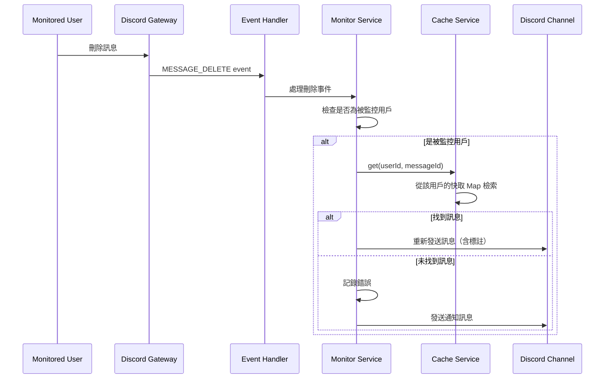

# 技術設計文件

## 概述

Discord 訊息監控系統是一個基於 Discord.js 的 bot 應用程式，用於監控特定用戶的訊息活動並在訊息被刪除時自動恢復。系統採用事件驅動架構，透過 Discord Gateway 接收即時事件，並使用記憶體快取配合持久化儲存來管理訊息資料。

本系統使用 **Bun** 作為執行環境，相較於傳統的 Node.js，Bun 提供：
- **更快的啟動速度**：冷啟動時間大幅縮短
- **更高的執行效能**：JavaScript/TypeScript 執行速度提升
- **內建 TypeScript 支援**：無需額外的編譯步驟
- **更快的套件安裝**：`bun install` 比 `npm install` 快數倍
- **內建測試執行器**：無需安裝 Jest 等額外測試框架

### 核心功能

1. **用戶監控管理**：管理員可透過斜線指令（Slash Commands）新增、移除和查看被監控的用戶清單
2. **訊息快取**：即時快取被監控用戶的所有訊息內容，包含文字、附件和嵌入內容。每個被監控用戶擁有獨立的快取空間，使用 Map<userId, Map<messageId, CachedMessage>> 結構管理
3. **刪除偵測與恢復**：偵測訊息刪除事件並自動在原頻道重新發送被刪除的訊息
4. **權限控制**：確保只有具備管理員權限的用戶能夠執行管理操作
5. **資料持久化**：將監控設定儲存至本地檔案系統，確保 bot 重啟後能恢復狀態

### 技術棧

- **執行環境**：Bun (v1.0+)
- **Discord 函式庫**：Discord.js v14
- **資料儲存**：SQLite（使用 Bun 內建的 `bun:sqlite` 模組）
- **日誌管理**：Winston
- **程式語言**：TypeScript

## 架構

### 系統架構圖



### 事件流程

#### 用戶監控管理流程



#### 訊息監控流程



#### 訊息刪除與恢復流程



## 元件與介面

### 1. Discord Client (主要入口)

**職責**：管理與 Discord 的連線、初始化所有服務和處理器

```typescript
class DiscordBot {
  private client: Client;
  private monitorService: MonitorService;
  private commandHandler: CommandHandler;
  private eventHandler: EventHandler;
  
  async start(): Promise<void>;
  async stop(): Promise<void>;
  private registerIntents(): void;
  private registerHandlers(): void;
}
```

### 2. Monitor Service (核心業務邏輯)

**職責**：管理被監控用戶清單、協調訊息快取和恢復操作。當新增或移除監控用戶時，同步管理對應的快取空間。

```typescript
interface MonitorService {
  // 用戶管理
  addMonitoredUser(userId: string, guildId: string): Promise<Result<void>>;
  removeMonitoredUser(userId: string, guildId: string): Promise<Result<void>>;
  getMonitoredUsers(guildId: string): Promise<string[]>;
  isUserMonitored(userId: string, guildId: string): boolean;
  
  // 訊息處理
  handleMessageCreate(message: Message): Promise<void>;
  handleMessageUpdate(oldMessage: Message, newMessage: Message): Promise<void>;
  handleMessageDelete(message: Message | PartialMessage): Promise<void>;
  
  // 初始化
  initialize(): Promise<void>;
}
```

### 3. Cache Service (訊息快取管理)

**職責**：管理訊息的記憶體快取，包含自動過期機制。每個被監控用戶擁有獨立的快取空間。

```typescript
interface CachedMessage {
  messageId: string;
  channelId: string;
  guildId: string;
  authorId: string;
  content: string;
  attachments: AttachmentData[];
  embeds: EmbedData[];
  timestamp: number;
  expiresAt: number;
}

interface AttachmentData {
  url: string;
  name: string;
  contentType?: string;
}

interface EmbedData {
  title?: string;
  description?: string;
  url?: string;
  color?: number;
  fields?: { name: string; value: string; inline?: boolean }[];
}

interface CacheService {
  // 用戶快取管理
  createUserCache(userId: string): void;
  deleteUserCache(userId: string): void;
  hasUserCache(userId: string): boolean;
  
  // 訊息操作（需指定用戶 ID）
  set(userId: string, messageId: string, message: CachedMessage): void;
  get(userId: string, messageId: string): CachedMessage | null;
  update(userId: string, messageId: string, message: Partial<CachedMessage>): boolean;
  delete(userId: string, messageId: string): boolean;
  
  // 清理操作
  cleanup(): void; // 清理所有用戶的過期訊息
  cleanupUser(userId: string): void; // 清理特定用戶的過期訊息
  
  // 統計資訊
  size(): number; // 總訊息數
  userSize(userId: string): number; // 特定用戶的訊息數
  userCount(): number; // 被監控用戶數量
}
```

**實作細節**：

```typescript
class CacheServiceImpl implements CacheService {
  // 使用 Map<userId, Map<messageId, CachedMessage>> 結構
  private userCaches: Map<string, Map<string, CachedMessage>>;
  private cleanupInterval: Timer;
  
  constructor() {
    this.userCaches = new Map();
    // 每小時執行一次清理
    this.cleanupInterval = setInterval(() => this.cleanup(), 60 * 60 * 1000);
  }
  
  createUserCache(userId: string): void {
    if (!this.userCaches.has(userId)) {
      this.userCaches.set(userId, new Map());
    }
  }
  
  deleteUserCache(userId: string): void {
    this.userCaches.delete(userId);
  }
  
  hasUserCache(userId: string): boolean {
    return this.userCaches.has(userId);
  }
  
  set(userId: string, messageId: string, message: CachedMessage): void {
    const userCache = this.userCaches.get(userId);
    if (userCache) {
      userCache.set(messageId, message);
    }
  }
  
  get(userId: string, messageId: string): CachedMessage | null {
    const userCache = this.userCaches.get(userId);
    return userCache?.get(messageId) || null;
  }
  
  update(userId: string, messageId: string, message: Partial<CachedMessage>): boolean {
    const userCache = this.userCaches.get(userId);
    const existing = userCache?.get(messageId);
    if (existing) {
      userCache!.set(messageId, { ...existing, ...message });
      return true;
    }
    return false;
  }
  
  delete(userId: string, messageId: string): boolean {
    const userCache = this.userCaches.get(userId);
    return userCache?.delete(messageId) || false;
  }
  
  cleanup(): void {
    const now = Date.now();
    for (const [userId, userCache] of this.userCaches.entries()) {
      for (const [messageId, message] of userCache.entries()) {
        if (message.expiresAt < now) {
          userCache.delete(messageId);
        }
      }
    }
  }
  
  cleanupUser(userId: string): void {
    const now = Date.now();
    const userCache = this.userCaches.get(userId);
    if (userCache) {
      for (const [messageId, message] of userCache.entries()) {
        if (message.expiresAt < now) {
          userCache.delete(messageId);
        }
      }
    }
  }
  
  size(): number {
    let total = 0;
    for (const userCache of this.userCaches.values()) {
      total += userCache.size;
    }
    return total;
  }
  
  userSize(userId: string): number {
    return this.userCaches.get(userId)?.size || 0;
  }
  
  userCount(): number {
    return this.userCaches.size;
  }
}
```

**快取管理策略**：

1. **用戶快取生命週期**：
   - 當用戶被新增至監控清單時，自動建立該用戶的快取空間
   - 當用戶被移除時，立即清理該用戶的所有快取訊息
   - 避免記憶體洩漏和不必要的資源佔用

2. **訊息過期機制**：
   - 每則訊息設定 7 天的過期時間
   - 每小時自動執行一次全域清理
   - 支援針對特定用戶的清理操作

3. **記憶體管理**：
   - 使用雙層 Map 結構提供 O(1) 的查詢效能
   - 按用戶隔離快取，避免單一用戶影響整體效能
   - 定期清理過期訊息，控制記憶體使用量

## 記憶體優化策略

### 背景

本系統需要在記憶體受限的環境（1GB）中運行，因此必須實施嚴格的記憶體管理策略。考慮到 Discord bot 的基礎消耗和訊息快取需求，我們需要確保系統在正常運作時不會超出記憶體限制。

### 記憶體使用分析

#### 基礎消耗估算

1. **Bun Runtime**：約 30-50 MB
   - Bun 相較於 Node.js 具有更低的記憶體佔用
   - 包含 JavaScript 引擎和基礎執行環境

2. **Discord.js 函式庫**：約 50-80 MB
   - Discord Client 連線和快取
   - 內建的訊息、頻道、用戶快取
   - WebSocket 連線緩衝區

3. **Winston 日誌系統**：約 10-20 MB
   - 日誌緩衝區
   - 檔案寫入緩衝

4. **應用程式程式碼**：約 10-20 MB
   - TypeScript 編譯後的程式碼
   - 服務實例和配置

**基礎消耗總計**：約 100-170 MB

#### 訊息快取消耗估算

每則快取訊息的平均大小：

```typescript
interface CachedMessage {
  messageId: string;        // ~20 bytes (Snowflake ID)
  channelId: string;        // ~20 bytes
  guildId: string;          // ~20 bytes
  authorId: string;         // ~20 bytes
  content: string;          // 平均 200 bytes (假設平均訊息長度)
  attachments: AttachmentData[];  // 平均 100 bytes (URL + metadata)
  embeds: EmbedData[];      // 平均 150 bytes
  timestamp: number;        // 8 bytes
  expiresAt: number;        // 8 bytes
}
```

**單則訊息估算**：約 550 bytes ≈ 0.5 KB

**快取容量計算**：

假設為系統預留 **400 MB** 作為訊息快取空間：

- 可快取訊息數量：400 MB ÷ 0.5 KB ≈ 800,000 則訊息
- 若監控 10 個用戶，每個用戶可快取：80,000 則訊息
- 若監控 50 個用戶，每個用戶可快取：16,000 則訊息

**實際限制**：考慮到安全邊際和其他動態記憶體使用，我們設定：

- **每個用戶最多快取 500 則訊息**
- **系統總記憶體使用上限：700 MB**（預留 300 MB 給系統和緩衝）

### 優化措施

#### 1. 訊息數量限制（LRU 策略）

實施 **Least Recently Used (LRU)** 快取策略，當用戶的訊息數量超過限制時，自動移除最舊的訊息。

```typescript
interface CacheConfig {
  maxMessagesPerUser: number;      // 預設 500
  maxTotalMemoryMB: number;        // 預設 700
  memoryCheckIntervalMs: number;   // 預設 300000 (5分鐘)
  cleanupIntervalMs: number;       // 預設 3600000 (1小時)
}

class CacheServiceImpl implements CacheService {
  private config: CacheConfig = {
    maxMessagesPerUser: 500,
    maxTotalMemoryMB: 700,
    memoryCheckIntervalMs: 5 * 60 * 1000,
    cleanupIntervalMs: 60 * 60 * 1000
  };
  
  set(userId: string, messageId: string, message: CachedMessage): void {
    const userCache = this.userCaches.get(userId);
    if (!userCache) return;
    
    // 檢查是否超過單用戶限制
    if (userCache.size >= this.config.maxMessagesPerUser) {
      this.evictOldestMessage(userId);
    }
    
    userCache.set(messageId, message);
  }
  
  private evictOldestMessage(userId: string): void {
    const userCache = this.userCaches.get(userId);
    if (!userCache || userCache.size === 0) return;
    
    // 找出最舊的訊息（最小的 timestamp）
    let oldestMessageId: string | null = null;
    let oldestTimestamp = Infinity;
    
    for (const [messageId, message] of userCache.entries()) {
      if (message.timestamp < oldestTimestamp) {
        oldestTimestamp = message.timestamp;
        oldestMessageId = messageId;
      }
    }
    
    if (oldestMessageId) {
      userCache.delete(oldestMessageId);
      logger.debug('LRU 清理：移除最舊訊息', { 
        userId, 
        messageId: oldestMessageId,
        timestamp: oldestTimestamp 
      });
    }
  }
}
```

#### 2. 記憶體監控機制

定期檢查系統記憶體使用量，當超過閾值時主動清理快取。

```typescript
class MemoryMonitor {
  private config: CacheConfig;
  private cacheService: CacheService;
  private monitorInterval: Timer;
  
  constructor(config: CacheConfig, cacheService: CacheService) {
    this.config = config;
    this.cacheService = cacheService;
    this.startMonitoring();
  }
  
  private startMonitoring(): void {
    this.monitorInterval = setInterval(
      () => this.checkMemoryUsage(),
      this.config.memoryCheckIntervalMs
    );
  }
  
  private checkMemoryUsage(): void {
    const memoryUsage = process.memoryUsage();
    const heapUsedMB = memoryUsage.heapUsed / 1024 / 1024;
    const rssUsedMB = memoryUsage.rss / 1024 / 1024;
    
    logger.debug('記憶體使用狀況', {
      heapUsedMB: heapUsedMB.toFixed(2),
      rssUsedMB: rssUsedMB.toFixed(2),
      cachedMessages: this.cacheService.size(),
      monitoredUsers: this.cacheService.userCount()
    });
    
    // 檢查是否超過閾值
    if (heapUsedMB > this.config.maxTotalMemoryMB * 0.8) {
      logger.warn('記憶體使用接近上限，開始主動清理', {
        heapUsedMB: heapUsedMB.toFixed(2),
        threshold: this.config.maxTotalMemoryMB * 0.8
      });
      this.performAggressiveCleanup();
    } else if (heapUsedMB > this.config.maxTotalMemoryMB * 0.9) {
      logger.error('記憶體使用嚴重超標，執行緊急清理', {
        heapUsedMB: heapUsedMB.toFixed(2),
        threshold: this.config.maxTotalMemoryMB * 0.9
      });
      this.performEmergencyCleanup();
    }
  }
  
  private performAggressiveCleanup(): void {
    // 1. 清理所有過期訊息
    this.cacheService.cleanup();
    
    // 2. 如果記憶體仍然過高，減少每個用戶的快取數量
    const memoryUsage = process.memoryUsage();
    const heapUsedMB = memoryUsage.heapUsed / 1024 / 1024;
    
    if (heapUsedMB > this.config.maxTotalMemoryMB * 0.75) {
      this.reduceUserCaches(0.5); // 每個用戶保留 50% 的訊息
    }
  }
  
  private performEmergencyCleanup(): void {
    logger.error('執行緊急記憶體清理');
    
    // 1. 清理所有過期訊息
    this.cacheService.cleanup();
    
    // 2. 大幅減少快取
    this.reduceUserCaches(0.3); // 每個用戶只保留 30% 的訊息
    
    // 3. 強制垃圾回收（如果可用）
    if (global.gc) {
      global.gc();
      logger.info('已執行強制垃圾回收');
    }
  }
  
  private reduceUserCaches(keepRatio: number): void {
    // 對每個用戶的快取進行縮減
    const userIds = this.getAllMonitoredUserIds();
    
    for (const userId of userIds) {
      const currentSize = this.cacheService.userSize(userId);
      const targetSize = Math.floor(currentSize * keepRatio);
      const toRemove = currentSize - targetSize;
      
      if (toRemove > 0) {
        this.removeOldestMessages(userId, toRemove);
      }
    }
    
    logger.info('快取縮減完成', {
      keepRatio,
      remainingMessages: this.cacheService.size()
    });
  }
  
  private removeOldestMessages(userId: string, count: number): void {
    // 實作移除指定數量的最舊訊息
    // 這需要 CacheService 提供相應的方法
  }
  
  private getAllMonitoredUserIds(): string[] {
    // 從 MonitorService 獲取所有被監控的用戶 ID
    return [];
  }
  
  stop(): void {
    if (this.monitorInterval) {
      clearInterval(this.monitorInterval);
    }
  }
}
```

#### 3. 選擇性快取（只保存必要欄位）

優化快取的資料結構，只保存恢復訊息所需的最少資訊。

```typescript
interface OptimizedCachedMessage {
  // 必要欄位
  messageId: string;
  channelId: string;
  authorId: string;
  content: string;
  timestamp: number;
  expiresAt: number;
  
  // 選擇性欄位（使用更緊湊的格式）
  attachmentUrls?: string[];  // 只保存 URL，不保存完整 metadata
  embedData?: string;         // 序列化為 JSON 字串，需要時再解析
}

// 轉換函數
function toOptimizedCache(message: Message): OptimizedCachedMessage {
  const optimized: OptimizedCachedMessage = {
    messageId: message.id,
    channelId: message.channelId,
    authorId: message.author.id,
    content: message.content,
    timestamp: message.createdTimestamp,
    expiresAt: Date.now() + 7 * 24 * 60 * 60 * 1000
  };
  
  // 只在有附件時才保存
  if (message.attachments.size > 0) {
    optimized.attachmentUrls = Array.from(message.attachments.values())
      .map(a => a.url);
  }
  
  // 只在有嵌入內容時才保存，並壓縮為 JSON
  if (message.embeds.length > 0) {
    optimized.embedData = JSON.stringify(
      message.embeds.map(e => ({
        t: e.title,
        d: e.description,
        c: e.color
      }))
    );
  }
  
  return optimized;
}
```

#### 4. 配置參數

提供可調整的配置參數，允許根據實際環境調整記憶體使用。

```typescript
// config/cache.config.ts
export interface CacheConfiguration {
  // 訊息限制
  maxMessagesPerUser: number;
  messageRetentionDays: number;
  
  // 記憶體限制
  maxTotalMemoryMB: number;
  memoryWarningThreshold: number;  // 0.8 = 80%
  memoryEmergencyThreshold: number; // 0.9 = 90%
  
  // 清理間隔
  cleanupIntervalMs: number;
  memoryCheckIntervalMs: number;
  
  // 優化選項
  useOptimizedCache: boolean;
  enableAggressiveCleanup: boolean;
}

export const defaultCacheConfig: CacheConfiguration = {
  maxMessagesPerUser: 500,
  messageRetentionDays: 7,
  maxTotalMemoryMB: 700,
  memoryWarningThreshold: 0.8,
  memoryEmergencyThreshold: 0.9,
  cleanupIntervalMs: 60 * 60 * 1000,      // 1 小時
  memoryCheckIntervalMs: 5 * 60 * 1000,   // 5 分鐘
  useOptimizedCache: true,
  enableAggressiveCleanup: true
};

// 環境變數覆寫
export function loadCacheConfig(): CacheConfiguration {
  return {
    ...defaultCacheConfig,
    maxMessagesPerUser: parseInt(process.env.MAX_MESSAGES_PER_USER || '500'),
    maxTotalMemoryMB: parseInt(process.env.MAX_MEMORY_MB || '700'),
    messageRetentionDays: parseInt(process.env.MESSAGE_RETENTION_DAYS || '7'),
    useOptimizedCache: process.env.USE_OPTIMIZED_CACHE !== 'false',
    enableAggressiveCleanup: process.env.ENABLE_AGGRESSIVE_CLEANUP !== 'false'
  };
}
```

#### 5. 更新 CacheService 介面

新增記憶體管理相關的方法：

```typescript
interface CacheService {
  // 原有方法...
  createUserCache(userId: string): void;
  deleteUserCache(userId: string): void;
  hasUserCache(userId: string): boolean;
  set(userId: string, messageId: string, message: CachedMessage): void;
  get(userId: string, messageId: string): CachedMessage | null;
  update(userId: string, messageId: string, message: Partial<CachedMessage>): boolean;
  delete(userId: string, messageId: string): boolean;
  cleanup(): void;
  cleanupUser(userId: string): void;
  size(): number;
  userSize(userId: string): number;
  userCount(): number;
  
  // 新增：記憶體管理方法
  getMemoryUsage(): MemoryUsageStats;
  reduceUserCache(userId: string, targetSize: number): number;
  removeOldestMessages(userId: string, count: number): number;
  getAllUserIds(): string[];
  setConfig(config: Partial<CacheConfiguration>): void;
  getConfig(): CacheConfiguration;
}

interface MemoryUsageStats {
  heapUsedMB: number;
  heapTotalMB: number;
  rssMB: number;
  cachedMessages: number;
  monitoredUsers: number;
  averageMessagesPerUser: number;
  estimatedCacheSizeMB: number;
}
```

### 監控與告警

#### 記憶體使用日誌

系統應定期記錄記憶體使用狀況：

```typescript
// 每 5 分鐘記錄一次
logger.info('記憶體使用報告', {
  heapUsed: '245.32 MB',
  heapTotal: '512.00 MB',
  rss: '380.50 MB',
  cachedMessages: 12450,
  monitoredUsers: 25,
  avgMessagesPerUser: 498,
  estimatedCacheSize: '6.23 MB'
});
```

#### 告警條件

當發生以下情況時，系統應發送告警：

1. **記憶體使用超過 80%**：警告級別，開始主動清理
2. **記憶體使用超過 90%**：錯誤級別，執行緊急清理
3. **單個用戶快取超過限制**：資訊級別，執行 LRU 清理
4. **快取清理失敗**：錯誤級別，可能需要重啟

### 效能影響評估

#### LRU 清理效能

- **時間複雜度**：O(n)，其中 n 是用戶的訊息數量
- **空間複雜度**：O(1)
- **影響**：每次新增訊息時可能需要清理一則舊訊息，對效能影響極小

#### 記憶體監控效能

- **檢查頻率**：每 5 分鐘一次
- **檢查耗時**：< 10ms
- **影響**：可忽略不計

#### 優化快取格式效能

- **記憶體節省**：約 20-30%（透過移除冗餘欄位和壓縮）
- **序列化/反序列化開銷**：< 1ms per message
- **影響**：可接受的權衡

### 測試建議

記憶體優化相關的測試應包含：

1. **單元測試**：
   - LRU 清理邏輯正確性
   - 記憶體監控閾值觸發
   - 配置參數載入和覆寫

2. **整合測試**：
   - 模擬高負載情況（大量訊息快取）
   - 記憶體超限時的自動清理
   - 多用戶並發快取操作

3. **壓力測試**：
   - 持續運行 24 小時，監控記憶體使用
   - 模擬 50 個用戶，每個用戶 500 則訊息
   - 驗證記憶體使用不超過 700 MB

4. **屬性測試**：
   - 任何快取操作後，記憶體使用應在合理範圍內
   - LRU 清理後，用戶快取大小應不超過限制


### 4. Storage Service (持久化儲存)

**職責**：使用 SQLite 資料庫管理監控設定的持久化儲存

**技術選擇**：使用 Bun 內建的 `bun:sqlite` 模組，無需額外安裝依賴套件。

**資料庫 Schema**：

```sql
-- 監控用戶表
CREATE TABLE IF NOT EXISTS monitored_users (
  id INTEGER PRIMARY KEY AUTOINCREMENT,
  guild_id TEXT NOT NULL,
  user_id TEXT NOT NULL,
  created_at INTEGER NOT NULL,
  updated_at INTEGER NOT NULL,
  UNIQUE(guild_id, user_id)
);

-- 建立索引以加速查詢
CREATE INDEX IF NOT EXISTS idx_guild_id ON monitored_users(guild_id);
CREATE INDEX IF NOT EXISTS idx_user_id ON monitored_users(user_id);
```

**介面定義**：

```typescript
interface MonitoredUser {
  id: number;
  guildId: string;
  userId: string;
  createdAt: number;
  updatedAt: number;
}

interface StorageService {
  // 初始化資料庫
  initialize(): Promise<void>;
  
  // 用戶管理
  addMonitoredUser(guildId: string, userId: string): Promise<void>;
  removeMonitoredUser(guildId: string, userId: string): Promise<void>;
  getMonitoredUsers(guildId: string): Promise<string[]>;
  getAllMonitoredUsers(): Promise<MonitoredUser[]>;
  isUserMonitored(guildId: string, userId: string): Promise<boolean>;
  
  // 資料庫管理
  close(): Promise<void>;
}
```

**實作範例**：

```typescript
import { Database } from 'bun:sqlite';

class SQLiteStorageService implements StorageService {
  private db: Database;
  private dbPath: string;
  
  constructor(dbPath: string = 'data/monitor.db') {
    this.dbPath = dbPath;
    this.db = new Database(dbPath, { create: true });
  }
  
  async initialize(): Promise<void> {
    // 建立資料表
    this.db.run(`
      CREATE TABLE IF NOT EXISTS monitored_users (
        id INTEGER PRIMARY KEY AUTOINCREMENT,
        guild_id TEXT NOT NULL,
        user_id TEXT NOT NULL,
        created_at INTEGER NOT NULL,
        updated_at INTEGER NOT NULL,
        UNIQUE(guild_id, user_id)
      )
    `);
    
    // 建立索引
    this.db.run(`
      CREATE INDEX IF NOT EXISTS idx_guild_id 
      ON monitored_users(guild_id)
    `);
    
    this.db.run(`
      CREATE INDEX IF NOT EXISTS idx_user_id 
      ON monitored_users(user_id)
    `);
    
    logger.info('SQLite 資料庫初始化完成', { dbPath: this.dbPath });
  }
  
  async addMonitoredUser(guildId: string, userId: string): Promise<void> {
    const now = Date.now();
    
    try {
      const stmt = this.db.prepare(`
        INSERT INTO monitored_users (guild_id, user_id, created_at, updated_at)
        VALUES (?, ?, ?, ?)
      `);
      
      stmt.run(guildId, userId, now, now);
      
      logger.info('新增監控用戶至資料庫', { guildId, userId });
    } catch (error: any) {
      // 處理唯一性約束違反（重複新增）
      if (error.message.includes('UNIQUE constraint failed')) {
        throw new Error('USER_ALREADY_MONITORED');
      }
      throw error;
    }
  }
  
  async removeMonitoredUser(guildId: string, userId: string): Promise<void> {
    const stmt = this.db.prepare(`
      DELETE FROM monitored_users 
      WHERE guild_id = ? AND user_id = ?
    `);
    
    const result = stmt.run(guildId, userId);
    
    if (result.changes === 0) {
      throw new Error('USER_NOT_MONITORED');
    }
    
    logger.info('從資料庫移除監控用戶', { guildId, userId });
  }
  
  async getMonitoredUsers(guildId: string): Promise<string[]> {
    const stmt = this.db.prepare(`
      SELECT user_id FROM monitored_users 
      WHERE guild_id = ?
      ORDER BY created_at ASC
    `);
    
    const rows = stmt.all(guildId) as Array<{ user_id: string }>;
    return rows.map(row => row.user_id);
  }
  
  async getAllMonitoredUsers(): Promise<MonitoredUser[]> {
    const stmt = this.db.prepare(`
      SELECT id, guild_id, user_id, created_at, updated_at 
      FROM monitored_users
      ORDER BY guild_id, created_at ASC
    `);
    
    const rows = stmt.all() as Array<{
      id: number;
      guild_id: string;
      user_id: string;
      created_at: number;
      updated_at: number;
    }>;
    
    return rows.map(row => ({
      id: row.id,
      guildId: row.guild_id,
      userId: row.user_id,
      createdAt: row.created_at,
      updatedAt: row.updated_at
    }));
  }
  
  async isUserMonitored(guildId: string, userId: string): Promise<boolean> {
    const stmt = this.db.prepare(`
      SELECT COUNT(*) as count FROM monitored_users 
      WHERE guild_id = ? AND user_id = ?
    `);
    
    const result = stmt.get(guildId, userId) as { count: number };
    return result.count > 0;
  }
  
  async close(): Promise<void> {
    this.db.close();
    logger.info('SQLite 資料庫連線已關閉');
  }
}
```

**優勢**：

1. **無需額外依賴**：Bun 內建 SQLite 支援，無需安裝額外套件
2. **效能優異**：相較於 JSON 檔案讀寫，SQLite 提供更好的查詢效能
3. **資料完整性**：支援 UNIQUE 約束，防止重複新增
4. **並發安全**：SQLite 提供檔案鎖定機制，支援並發讀取
5. **可擴展性**：未來可輕鬆新增更多欄位或表格
6. **查詢靈活**：支援複雜的 SQL 查詢和索引優化

**資料庫檔案位置**：`data/monitor.db`

### 5. Command Handler (指令處理)

**職責**：處理斜線指令並驗證權限

```typescript
interface CommandHandler {
  registerCommands(client: Client): Promise<void>;
  handleAddMonitor(interaction: CommandInteraction): Promise<void>;
  handleRemoveMonitor(interaction: CommandInteraction): Promise<void>;
  handleListMonitors(interaction: CommandInteraction): Promise<void>;
  checkPermissions(interaction: CommandInteraction): boolean;
}
```

**指令定義**：

- `/monitor add <user>` - 新增被監控用戶
- `/monitor remove <user>` - 移除被監控用戶
- `/monitor list` - 列出所有被監控用戶

### 6. Event Handler (事件處理)

**職責**：接收 Discord 事件並分派至適當的服務

```typescript
interface EventHandler {
  onReady(client: Client): void;
  onMessageCreate(message: Message): Promise<void>;
  onMessageUpdate(oldMessage: Message, newMessage: Message): Promise<void>;
  onMessageDelete(message: Message | PartialMessage): Promise<void>;
  onError(error: Error): void;
}
```

### 7. Logger (日誌管理)

**職責**：統一的日誌記錄介面

```typescript
interface Logger {
  info(message: string, meta?: object): void;
  warn(message: string, meta?: object): void;
  error(message: string, error?: Error, meta?: object): void;
  debug(message: string, meta?: object): void;
}
```

## 資料模型

### 監控用戶資料（SQLite）

儲存於 `data/monitor.db` 的 SQLite 資料庫中

**資料表結構**：

```sql
CREATE TABLE monitored_users (
  id INTEGER PRIMARY KEY AUTOINCREMENT,
  guild_id TEXT NOT NULL,
  user_id TEXT NOT NULL,
  created_at INTEGER NOT NULL,
  updated_at INTEGER NOT NULL,
  UNIQUE(guild_id, user_id)
);
```

**範例資料**：

| id | guild_id | user_id | created_at | updated_at |
|----|----------|---------|------------|------------|
| 1  | 123456789 | 987654321 | 1704067200000 | 1704067200000 |
| 2  | 123456789 | 111222333 | 1704067300000 | 1704067300000 |
| 3  | 987654321 | 444555666 | 1704067400000 | 1704067400000 |

**欄位說明**：

- `id`：自動遞增的主鍵
- `guild_id`：Discord 伺服器 ID
- `user_id`：被監控的用戶 ID
- `created_at`：新增時間戳記（毫秒）
- `updated_at`：最後更新時間戳記（毫秒）

**索引**：

- `idx_guild_id`：加速按伺服器查詢
- `idx_user_id`：加速按用戶查詢
- `UNIQUE(guild_id, user_id)`：防止重複新增

### 快取訊息 (Cached Message)

儲存於記憶體中，結構如下：

```typescript
{
  messageId: "1234567890",
  channelId: "9876543210",
  guildId: "123456789",
  authorId: "987654321",
  content: "這是一則訊息",
  attachments: [
    {
      url: "https://cdn.discordapp.com/attachments/...",
      name: "image.png",
      contentType: "image/png"
    }
  ],
  embeds: [
    {
      title: "嵌入標題",
      description: "嵌入描述",
      color: 0x5865F2
    }
  ],
  timestamp: 1704067200000,
  expiresAt: 1704672000000  // 7 天後
}
```

### 恢復訊息格式

當訊息被刪除並重新發送時，使用以下格式：

```
🔄 **訊息已被刪除並恢復**

**原始發送者：** @username
**原始時間：** 2024-01-01 12:00:00
**刪除時間：** 2024-01-01 12:05:00

**訊息內容：**
[原始訊息內容]

**附件：**
- [附件名稱](附件連結)
```


## 正確性屬性

*屬性是指在系統所有有效執行過程中都應該成立的特性或行為——本質上是關於系統應該做什麼的正式陳述。屬性作為人類可讀規格與機器可驗證正確性保證之間的橋樑。*

### 屬性 1：用戶存在性驗證

*對於任何*用戶 ID，當管理員嘗試將其新增至監控清單時，如果該用戶不存在於伺服器中，則新增操作應該失敗並返回錯誤訊息。

**驗證需求：1.4**

### 屬性 2：重複新增防護

*對於任何*已在監控清單中的用戶 ID，當管理員嘗試再次新增時，系統應該返回提示訊息表示該用戶已被監控，且清單內容保持不變。

**驗證需求：1.5**

### 屬性 3：訊息快取完整性

*對於任何*被監控用戶在任何頻道發送的訊息，系統應該將其儲存至快取，且快取內容必須包含文字內容、附件連結、嵌入內容和時間戳記等所有必要欄位。

**驗證需求：2.1, 2.2, 2.3**

### 屬性 4：訊息更新同步

*對於任何*被監控用戶編輯的訊息，快取中對應的訊息內容應該被更新為最新版本。

**驗證需求：2.4**

### 屬性 5：快取保留期限

*對於任何*快取的訊息，在其建立後的 7 天內都應該可以被成功檢索。

**驗證需求：2.5**

### 屬性 6：刪除事件偵測

*對於任何*被監控用戶刪除的訊息，系統應該偵測到刪除事件並觸發恢復流程。

**驗證需求：3.1**

### 屬性 7：訊息檢索與恢復

*對於任何*被刪除的已快取訊息，系統應該能夠從快取中檢索該訊息並在原頻道重新發送。

**驗證需求：3.2, 3.3**

### 屬性 8：恢復訊息元資料完整性

*對於任何*重新發送的訊息，其內容應該包含原始發送者、原始發送時間和刪除時間等元資料標註。

**驗證需求：3.4**

### 屬性 9：恢復訊息內容完整性

*對於任何*重新發送的訊息，其內容應該包含原始訊息的所有文字內容和附件連結。

**驗證需求：3.5**

### 屬性 10：快取未命中處理

*對於任何*被刪除但快取中找不到的訊息，系統應該記錄錯誤並發送通知訊息。

**驗證需求：3.6**

### 屬性 11：權限控制

*對於任何*管理指令的執行請求，只有具備「管理伺服器」或「管理員」權限的用戶才能成功執行，其他用戶應該收到權限不足的錯誤訊息。

**驗證需求：4.1, 4.2, 4.3**

### 屬性 12：監控設定持久化往返

*對於任何*監控清單的修改操作，修改後的清單應該被儲存至持久化儲存，且在系統重啟後載入時應該得到相同的清單內容。

**驗證需求：6.1, 6.2**

### 屬性 13：持久化載入失敗降級

*對於任何*持久化儲存讀取失敗的情況，系統應該使用空的監控清單繼續運作，並記錄警告訊息。

**驗證需求：6.4**

### 屬性 14：錯誤日誌完整性

*對於任何*系統遇到的錯誤，日誌記錄應該包含錯誤訊息、堆疊追蹤和相關上下文資訊。

**驗證需求：7.1**

### 屬性 15：關鍵操作日誌記錄

*對於任何*關鍵操作（如新增/移除監控用戶、訊息恢復），系統應該記錄操作日誌。

**驗證需求：7.2**

### 屬性 16：日誌輪替

*對於任何*日誌檔案，當其大小超過 10MB 時，系統應該執行輪替並保留最近 5 個日誌檔案。

**驗證需求：7.4**

### 屬性 17：API 失敗處理

*對於任何*Discord API 請求失敗，系統應該記錄失敗原因，並在適當的情況下進行重試。

**驗證需求：7.5**

### 屬性 18：訊息恢復失敗通知

*對於任何*無法重新發送的被刪除訊息，系統應該記錄失敗原因並通知管理員。

**驗證需求：7.6**

### 屬性 19：用戶快取隔離

*對於任何*兩個不同的被監控用戶，一個用戶的快取操作（新增、更新、刪除）不應影響另一個用戶的快取內容。

**驗證需求：2.1, 2.2**

### 屬性 20：快取生命週期同步

*對於任何*被監控用戶，當該用戶被移除監控清單時，系統應該立即清理該用戶的所有快取訊息。

**驗證需求：1.3, 2.5**

## 錯誤處理

### 錯誤分類

系統將錯誤分為以下類別：

1. **Discord API 錯誤**
   - 連線失敗
   - 認證失敗
   - 速率限制
   - 權限不足
   - 資源不存在

2. **業務邏輯錯誤**
   - 用戶不存在於伺服器
   - 重複新增監控用戶
   - 快取未命中

3. **系統錯誤**
   - 檔案系統錯誤
   - 記憶體不足
   - 未預期的例外

### 錯誤處理策略

#### 1. Discord API 錯誤處理

```typescript
class DiscordAPIErrorHandler {
  async handleAPIError(error: DiscordAPIError): Promise<void> {
    switch (error.code) {
      case 50001: // Missing Access
        logger.error('權限不足', { error });
        // 不重試，記錄錯誤
        break;
        
      case 50013: // Missing Permissions
        logger.error('缺少必要權限', { error });
        // 通知管理員
        break;
        
      case 10008: // Unknown Message
        logger.warn('訊息不存在', { error });
        // 正常情況，不需要特別處理
        break;
        
      case 429: // Rate Limited
        const retryAfter = error.retry_after || 1000;
        logger.warn(`速率限制，${retryAfter}ms 後重試`, { error });
        await this.retryWithBackoff(retryAfter);
        break;
        
      default:
        logger.error('Discord API 錯誤', { error });
        // 使用指數退避重試
        await this.retryWithExponentialBackoff();
    }
  }
  
  private async retryWithExponentialBackoff(
    attempt: number = 1,
    maxAttempts: number = 3
  ): Promise<void> {
    if (attempt > maxAttempts) {
      throw new Error('達到最大重試次數');
    }
    
    const delay = Math.pow(2, attempt) * 1000;
    await new Promise(resolve => setTimeout(resolve, delay));
  }
}
```

#### 2. 快取未命中處理

當訊息被刪除但快取中找不到時：

```typescript
async handleCacheMiss(messageId: string, channelId: string): Promise<void> {
  logger.error('快取未命中', { messageId, channelId });
  
  const channel = await client.channels.fetch(channelId);
  if (channel?.isTextBased()) {
    await channel.send({
      embeds: [{
        color: 0xFF0000,
        title: '⚠️ 訊息恢復失敗',
        description: '無法從快取中找到被刪除的訊息內容。',
        fields: [
          { name: '訊息 ID', value: messageId, inline: true },
          { name: '時間', value: new Date().toISOString(), inline: true }
        ]
      }]
    });
  }
}
```

#### 3. 持久化儲存錯誤處理

```typescript
async initializeWithRetry(): Promise<void> {
  const maxRetries = 3;
  for (let i = 0; i < maxRetries; i++) {
    try {
      await this.storageService.initialize();
      logger.info('SQLite 資料庫初始化成功');
      return;
    } catch (error) {
      logger.error(`資料庫初始化失敗 (嘗試 ${i + 1}/${maxRetries})`, { error });
      if (i === maxRetries - 1) {
        throw new Error('無法初始化資料庫，請檢查檔案權限和磁碟空間');
      }
      await new Promise(resolve => setTimeout(resolve, 1000 * (i + 1)));
    }
  }
}

async addMonitoredUserWithErrorHandling(
  guildId: string, 
  userId: string
): Promise<Result<void>> {
  try {
    await this.storageService.addMonitoredUser(guildId, userId);
    return { success: true };
  } catch (error: any) {
    if (error.message === 'USER_ALREADY_MONITORED') {
      return {
        success: false,
        error: {
          code: 'USER_ALREADY_MONITORED',
          message: '該用戶已在監控清單中'
        }
      };
    }
    
    // SQLite 錯誤處理
    if (error.message.includes('SQLITE_BUSY')) {
      logger.warn('資料庫忙碌，稍後重試', { error });
      return {
        success: false,
        error: {
          code: 'DATABASE_BUSY',
          message: '資料庫忙碌，請稍後再試'
        }
      };
    }
    
    if (error.message.includes('SQLITE_READONLY')) {
      logger.error('資料庫唯讀，無法寫入', { error });
      return {
        success: false,
        error: {
          code: 'DATABASE_READONLY',
          message: '資料庫唯讀，請檢查檔案權限'
        }
      };
    }
    
    logger.error('新增監控用戶時發生未預期錯誤', { error });
    return {
      success: false,
      error: {
        code: 'UNKNOWN_ERROR',
        message: '發生未預期錯誤'
      }
    };
  }
}

async loadMonitoredUsersWithFallback(guildId: string): Promise<string[]> {
  try {
    return await this.storageService.getMonitoredUsers(guildId);
  } catch (error) {
    logger.warn('載入監控用戶清單失敗，返回空清單', { guildId, error });
    return [];
  }
}

// 優雅關閉資料庫連線
async gracefulShutdown(): Promise<void> {
  try {
    await this.storageService.close();
    logger.info('資料庫連線已安全關閉');
  } catch (error) {
    logger.error('關閉資料庫連線時發生錯誤', { error });
  }
}
```

**SQLite 特定錯誤碼**：

- `SQLITE_BUSY`：資料庫被鎖定，需要重試
- `SQLITE_READONLY`：資料庫唯讀，檢查檔案權限
- `SQLITE_CORRUPT`：資料庫損壞，需要修復或重建
- `SQLITE_FULL`：磁碟空間不足
- `UNIQUE constraint failed`：違反唯一性約束（重複新增）

#### 4. 全域錯誤處理

```typescript
process.on('unhandledRejection', (error: Error) => {
  logger.error('未處理的 Promise 拒絕', { error });
});

process.on('uncaughtException', (error: Error) => {
  logger.error('未捕獲的例外', { error });
  // 優雅關閉
  gracefulShutdown();
});

client.on('error', (error: Error) => {
  logger.error('Discord Client 錯誤', { error });
});
```

### 錯誤回應格式

所有指令錯誤回應使用統一格式：

```typescript
interface ErrorResponse {
  success: false;
  error: {
    code: string;
    message: string;
    details?: object;
  };
}

// 範例
{
  success: false,
  error: {
    code: 'USER_NOT_FOUND',
    message: '找不到指定的用戶',
    details: { userId: '123456789' }
  }
}
```

## 測試策略

### 測試方法

本系統採用**雙重測試方法**，結合單元測試和基於屬性的測試：

- **單元測試**：驗證特定範例、邊界情況和錯誤條件
- **屬性測試**：透過隨機化驗證所有輸入的通用屬性
- 兩者互補且都是必要的，以實現全面覆蓋

### 測試框架

**測試執行環境**：Bun 內建測試執行器（`bun test`）
- Bun 提供與 Jest 相容的 API，包含 `describe`、`it`、`expect` 等
- 原生支援 TypeScript，無需額外配置
- 執行速度比 Node.js 測試執行器快數倍

**模擬（Mocking）**：使用 Bun 內建的 `mock()` 函數
- `Bun.mock()` 用於模組模擬
- `jest.fn()` 和 `jest.spyOn()` 在 Bun 中同樣可用

### 基於屬性的測試配置

**測試框架選擇**：使用 `fast-check` 作為 TypeScript 的屬性測試函式庫

**配置要求**：
- 每個屬性測試最少執行 100 次迭代（由於隨機化）
- 每個測試必須標註對應的設計文件屬性
- 標註格式：`Feature: discord-message-monitor, Property {編號}: {屬性文字}`

### 測試範圍

#### 1. 單元測試

**Monitor Service 測試**

```typescript
describe('MonitorService', () => {
  describe('addMonitoredUser', () => {
    it('應該成功新增存在的用戶並建立快取', async () => {
      const result = await monitorService.addMonitoredUser('user1', 'guild1');
      
      expect(result.success).toBe(true);
      expect(cacheService.hasUserCache('user1')).toBe(true);
    });
    
    it('應該拒絕不存在的用戶', async () => {
      // 測試需求 1.4
      mockGuild.members.fetch.mockRejectedValue(new Error('Unknown User'));
      
      const result = await monitorService.addMonitoredUser('invalid', 'guild1');
      
      expect(result.success).toBe(false);
      expect(cacheService.hasUserCache('invalid')).toBe(false);
    });
    
    it('應該拒絕重複新增', async () => {
      // 測試需求 1.5
      await monitorService.addMonitoredUser('user1', 'guild1');
      const result = await monitorService.addMonitoredUser('user1', 'guild1');
      
      expect(result.success).toBe(false);
    });
  });
  
  describe('removeMonitoredUser', () => {
    it('應該移除用戶並清理快取', async () => {
      await monitorService.addMonitoredUser('user1', 'guild1');
      cacheService.set('user1', 'msg1', createTestMessage());
      
      const result = await monitorService.removeMonitoredUser('user1', 'guild1');
      
      expect(result.success).toBe(true);
      expect(cacheService.hasUserCache('user1')).toBe(false);
    });
  });
  
  describe('handleMessageCreate', () => {
    it('應該快取被監控用戶的訊息', async () => {
      await monitorService.addMonitoredUser('user1', 'guild1');
      const message = createTestMessage({ authorId: 'user1' });
      
      await monitorService.handleMessageCreate(message);
      
      const cached = cacheService.get('user1', message.id);
      expect(cached).toBeDefined();
      expect(cached?.content).toBe(message.content);
    });
    
    it('應該忽略非監控用戶的訊息', async () => {
      const message = createTestMessage({ authorId: 'user2' });
      
      await monitorService.handleMessageCreate(message);
      
      expect(cacheService.get('user2', message.id)).toBeNull();
    });
  });
  
  describe('handleMessageDelete', () => {
    it('應該恢復被刪除的訊息', async () => {
      await monitorService.addMonitoredUser('user1', 'guild1');
      const message = createTestMessage({ authorId: 'user1' });
      
      await monitorService.handleMessageCreate(message);
      
      const sendSpy = jest.spyOn(message.channel, 'send');
      await monitorService.handleMessageDelete(message);
      
      expect(sendSpy).toHaveBeenCalled();
    });
    
    it('應該處理快取未命中情況', async () => {
      // 測試需求 3.6
      await monitorService.addMonitoredUser('user1', 'guild1');
      const message = createTestMessage({ authorId: 'user1' });
      
      const sendSpy = jest.spyOn(message.channel, 'send');
      await monitorService.handleMessageDelete(message);
      
      expect(sendSpy).toHaveBeenCalled();
      const sentContent = sendSpy.mock.calls[0][0];
      expect(sentContent.embeds[0].title).toContain('失敗');
    });
  });
});
```

**Cache Service 測試**

```typescript
describe('CacheService', () => {
  describe('用戶快取管理', () => {
    it('應該為新用戶建立獨立快取', () => {
      cacheService.createUserCache('user1');
      expect(cacheService.hasUserCache('user1')).toBe(true);
      expect(cacheService.userSize('user1')).toBe(0);
    });
    
    it('應該刪除用戶的所有快取訊息', () => {
      cacheService.createUserCache('user1');
      cacheService.set('user1', 'msg1', createTestMessage());
      cacheService.set('user1', 'msg2', createTestMessage());
      
      cacheService.deleteUserCache('user1');
      
      expect(cacheService.hasUserCache('user1')).toBe(false);
      expect(cacheService.get('user1', 'msg1')).toBeNull();
    });
  });
  
  describe('訊息操作', () => {
    beforeEach(() => {
      cacheService.createUserCache('user1');
    });
    
    it('應該儲存和檢索特定用戶的訊息', () => {
      const message = createTestMessage();
      cacheService.set('user1', 'msg1', message);
      
      const retrieved = cacheService.get('user1', 'msg1');
      expect(retrieved).toEqual(message);
    });
    
    it('應該隔離不同用戶的快取', () => {
      cacheService.createUserCache('user2');
      
      cacheService.set('user1', 'msg1', createTestMessage({ content: 'User 1' }));
      cacheService.set('user2', 'msg1', createTestMessage({ content: 'User 2' }));
      
      expect(cacheService.get('user1', 'msg1')?.content).toBe('User 1');
      expect(cacheService.get('user2', 'msg1')?.content).toBe('User 2');
    });
    
    it('應該在 7 天後清理過期訊息', () => {
      const now = Date.now();
      const message = createTestMessage({ 
        timestamp: now,
        expiresAt: now + 7 * 24 * 60 * 60 * 1000 
      });
      
      cacheService.set('user1', 'msg1', message);
      
      // 模擬 7 天後
      jest.setSystemTime(now + 7 * 24 * 60 * 60 * 1000 + 1);
      cacheService.cleanup();
      
      expect(cacheService.get('user1', 'msg1')).toBeNull();
    });
    
    it('應該正確更新訊息', () => {
      cacheService.set('user1', 'msg1', createTestMessage({ content: 'Original' }));
      
      cacheService.update('user1', 'msg1', { content: 'Updated' });
      
      expect(cacheService.get('user1', 'msg1')?.content).toBe('Updated');
    });
  });
  
  describe('統計資訊', () => {
    it('應該正確計算總訊息數', () => {
      cacheService.createUserCache('user1');
      cacheService.createUserCache('user2');
      
      cacheService.set('user1', 'msg1', createTestMessage());
      cacheService.set('user1', 'msg2', createTestMessage());
      cacheService.set('user2', 'msg3', createTestMessage());
      
      expect(cacheService.size()).toBe(3);
      expect(cacheService.userSize('user1')).toBe(2);
      expect(cacheService.userSize('user2')).toBe(1);
      expect(cacheService.userCount()).toBe(2);
    });
  });
});
```

**Storage Service 測試**

```typescript
describe('StorageService (SQLite)', () => {
  let storageService: SQLiteStorageService;
  let testDbPath: string;
  
  beforeEach(async () => {
    // 使用臨時資料庫進行測試
    testDbPath = `test-${Date.now()}.db`;
    storageService = new SQLiteStorageService(testDbPath);
    await storageService.initialize();
  });
  
  afterEach(async () => {
    await storageService.close();
    // 清理測試資料庫
    await Bun.file(testDbPath).delete();
  });
  
  describe('初始化', () => {
    it('應該建立資料表和索引', async () => {
      // 驗證資料表存在
      const users = await storageService.getAllMonitoredUsers();
      expect(users).toEqual([]);
    });
  });
  
  describe('新增監控用戶', () => {
    it('應該成功新增用戶', async () => {
      await storageService.addMonitoredUser('guild1', 'user1');
      
      const users = await storageService.getMonitoredUsers('guild1');
      expect(users).toContain('user1');
    });
    
    it('應該拒絕重複新增', async () => {
      await storageService.addMonitoredUser('guild1', 'user1');
      
      await expect(
        storageService.addMonitoredUser('guild1', 'user1')
      ).rejects.toThrow('USER_ALREADY_MONITORED');
    });
    
    it('應該允許不同伺服器監控相同用戶', async () => {
      await storageService.addMonitoredUser('guild1', 'user1');
      await storageService.addMonitoredUser('guild2', 'user1');
      
      const guild1Users = await storageService.getMonitoredUsers('guild1');
      const guild2Users = await storageService.getMonitoredUsers('guild2');
      
      expect(guild1Users).toContain('user1');
      expect(guild2Users).toContain('user1');
    });
  });
  
  describe('移除監控用戶', () => {
    it('應該成功移除用戶', async () => {
      await storageService.addMonitoredUser('guild1', 'user1');
      await storageService.removeMonitoredUser('guild1', 'user1');
      
      const users = await storageService.getMonitoredUsers('guild1');
      expect(users).not.toContain('user1');
    });
    
    it('應該在移除不存在的用戶時拋出錯誤', async () => {
      await expect(
        storageService.removeMonitoredUser('guild1', 'user1')
      ).rejects.toThrow('USER_NOT_MONITORED');
    });
  });
  
  describe('查詢監控用戶', () => {
    it('應該返回指定伺服器的所有監控用戶', async () => {
      await storageService.addMonitoredUser('guild1', 'user1');
      await storageService.addMonitoredUser('guild1', 'user2');
      await storageService.addMonitoredUser('guild2', 'user3');
      
      const guild1Users = await storageService.getMonitoredUsers('guild1');
      
      expect(guild1Users).toHaveLength(2);
      expect(guild1Users).toContain('user1');
      expect(guild1Users).toContain('user2');
      expect(guild1Users).not.toContain('user3');
    });
    
    it('應該返回空陣列當伺服器沒有監控用戶', async () => {
      const users = await storageService.getMonitoredUsers('guild1');
      expect(users).toEqual([]);
    });
  });
  
  describe('檢查用戶是否被監控', () => {
    it('應該正確判斷用戶是否被監控', async () => {
      await storageService.addMonitoredUser('guild1', 'user1');
      
      expect(await storageService.isUserMonitored('guild1', 'user1')).toBe(true);
      expect(await storageService.isUserMonitored('guild1', 'user2')).toBe(false);
      expect(await storageService.isUserMonitored('guild2', 'user1')).toBe(false);
    });
  });
  
  describe('資料持久化', () => {
    it('應該在重新開啟後保留資料', async () => {
      // 新增資料
      await storageService.addMonitoredUser('guild1', 'user1');
      await storageService.addMonitoredUser('guild1', 'user2');
      await storageService.close();
      
      // 重新開啟資料庫
      const newService = new SQLiteStorageService(testDbPath);
      await newService.initialize();
      
      const users = await newService.getMonitoredUsers('guild1');
      expect(users).toHaveLength(2);
      expect(users).toContain('user1');
      expect(users).toContain('user2');
      
      await newService.close();
    });
  });
  
  describe('錯誤處理', () => {
    it('應該處理資料庫檔案不存在的情況', async () => {
      // 測試需求 6.4
      const newService = new SQLiteStorageService('nonexistent.db');
      await expect(newService.initialize()).resolves.not.toThrow();
      await newService.close();
      await Bun.file('nonexistent.db').delete();
    });
  });
});
```

**Command Handler 測試**

```typescript
describe('CommandHandler', () => {
  it('應該驗證管理員權限', async () => {
    // 測試需求 4.1, 4.2, 4.3
  });
  
  it('應該拒絕無權限用戶', async () => {
    // 測試需求 4.2
  });
});
```

#### 2. 基於屬性的測試

**屬性 1-2：用戶管理**

```typescript
import fc from 'fast-check';

describe('Property Tests: User Management', () => {
  // Feature: discord-message-monitor, Property 1: 用戶存在性驗證
  it('屬性 1：不存在的用戶應該無法被新增', async () => {
    await fc.assert(
      fc.asyncProperty(
        fc.string(), // 隨機用戶 ID
        fc.string(), // 隨機伺服器 ID
        async (userId, guildId) => {
          // 假設用戶不存在
          mockGuild.members.fetch.mockRejectedValue(new Error('Unknown User'));
          
          const result = await monitorService.addMonitoredUser(userId, guildId);
          
          expect(result.success).toBe(false);
          expect(result.error?.code).toBe('USER_NOT_FOUND');
        }
      ),
      { numRuns: 100 }
    );
  });
  
  // Feature: discord-message-monitor, Property 2: 重複新增防護
  it('屬性 2：重複新增應該返回提示訊息', async () => {
    await fc.assert(
      fc.asyncProperty(
        fc.string(),
        fc.string(),
        async (userId, guildId) => {
          // 先新增一次
          await monitorService.addMonitoredUser(userId, guildId);
          
          // 再次新增
          const result = await monitorService.addMonitoredUser(userId, guildId);
          
          expect(result.success).toBe(false);
          expect(result.error?.code).toBe('USER_ALREADY_MONITORED');
          
          // 清單應該只有一個
          const users = await monitorService.getMonitoredUsers(guildId);
          expect(users.filter(id => id === userId).length).toBe(1);
        }
      ),
      { numRuns: 100 }
    );
  });
});
```

**屬性 3-5：訊息快取**

```typescript
describe('Property Tests: Message Caching', () => {
  // Feature: discord-message-monitor, Property 3: 訊息快取完整性
  it('屬性 3：所有被監控用戶的訊息都應該被完整快取', async () => {
    await fc.assert(
      fc.asyncProperty(
        arbitraryMessage(), // 自定義的訊息生成器
        async (message) => {
          // 確保用戶被監控且有快取空間
          await monitorService.addMonitoredUser(message.author.id, message.guild.id);
          
          await monitorService.handleMessageCreate(message);
          
          const cached = cacheService.get(message.author.id, message.id);
          
          expect(cached).toBeDefined();
          expect(cached?.content).toBe(message.content);
          expect(cached?.attachments).toHaveLength(message.attachments.size);
          expect(cached?.embeds).toHaveLength(message.embeds.length);
          expect(cached?.timestamp).toBeDefined();
        }
      ),
      { numRuns: 100 }
    );
  });
  
  // Feature: discord-message-monitor, Property 4: 訊息更新同步
  it('屬性 4：編輯訊息應該更新快取', async () => {
    await fc.assert(
      fc.asyncProperty(
        arbitraryMessage(),
        fc.string(), // 新內容
        async (originalMessage, newContent) => {
          // 確保用戶被監控
          await monitorService.addMonitoredUser(originalMessage.author.id, originalMessage.guild.id);
          
          // 先快取原始訊息
          await monitorService.handleMessageCreate(originalMessage);
          
          // 編輯訊息
          const editedMessage = { ...originalMessage, content: newContent };
          await monitorService.handleMessageUpdate(originalMessage, editedMessage);
          
          const cached = cacheService.get(originalMessage.author.id, originalMessage.id);
          expect(cached?.content).toBe(newContent);
        }
      ),
      { numRuns: 100 }
    );
  });
  
  // Feature: discord-message-monitor, Property 5: 快取保留期限
  it('屬性 5：訊息應該在 7 天內可被檢索', async () => {
    await fc.assert(
      fc.asyncProperty(
        arbitraryMessage(),
        fc.integer({ min: 0, max: 7 * 24 * 60 * 60 * 1000 - 1 }), // 0-7天內的毫秒數
        async (message, timeOffset) => {
          // 確保用戶被監控
          await monitorService.addMonitoredUser(message.author.id, message.guild.id);
          
          await monitorService.handleMessageCreate(message);
          
          // 模擬時間前進
          jest.advanceTimersByTime(timeOffset);
          
          const cached = cacheService.get(message.author.id, message.id);
          expect(cached).toBeDefined();
        }
      ),
      { numRuns: 100 }
    );
  });
});
```

**屬性 6-10：訊息刪除與恢復**

```typescript
describe('Property Tests: Message Deletion and Recovery', () => {
  // Feature: discord-message-monitor, Property 7: 訊息檢索與恢復
  it('屬性 7：被刪除的訊息應該被恢復', async () => {
    await fc.assert(
      fc.asyncProperty(
        arbitraryMessage(),
        async (message) => {
          // 先快取訊息
          await monitorService.handleMessageCreate(message);
          
          // 模擬刪除
          const sendSpy = jest.spyOn(message.channel, 'send');
          await monitorService.handleMessageDelete(message);
          
          // 應該重新發送
          expect(sendSpy).toHaveBeenCalled();
        }
      ),
      { numRuns: 100 }
    );
  });
  
  // Feature: discord-message-monitor, Property 8: 恢復訊息元資料完整性
  it('屬性 8：恢復的訊息應該包含元資料', async () => {
    await fc.assert(
      fc.asyncProperty(
        arbitraryMessage(),
        async (message) => {
          await monitorService.handleMessageCreate(message);
          
          const sendSpy = jest.spyOn(message.channel, 'send');
          await monitorService.handleMessageDelete(message);
          
          const sentContent = sendSpy.mock.calls[0][0];
          const embedDescription = sentContent.embeds[0].description;
          
          expect(embedDescription).toContain(message.author.tag);
          expect(embedDescription).toContain('原始時間');
          expect(embedDescription).toContain('刪除時間');
        }
      ),
      { numRuns: 100 }
    );
  });
  
  // Feature: discord-message-monitor, Property 9: 恢復訊息內容完整性
  it('屬性 9：恢復的訊息應該包含完整內容', async () => {
    await fc.assert(
      fc.asyncProperty(
        arbitraryMessage(),
        async (message) => {
          await monitorService.handleMessageCreate(message);
          
          const sendSpy = jest.spyOn(message.channel, 'send');
          await monitorService.handleMessageDelete(message);
          
          const sentContent = sendSpy.mock.calls[0][0];
          const embedDescription = sentContent.embeds[0].description;
          
          expect(embedDescription).toContain(message.content);
          
          // 檢查附件
          message.attachments.forEach(attachment => {
            expect(embedDescription).toContain(attachment.url);
          });
        }
      ),
      { numRuns: 100 }
    );
  });
  
  // Feature: discord-message-monitor, Property 10: 快取未命中處理
  it('屬性 10：快取未命中應該發送通知', async () => {
    await fc.assert(
      fc.asyncProperty(
        arbitraryMessage(),
        async (message) => {
          // 不快取訊息，直接刪除
          const sendSpy = jest.spyOn(message.channel, 'send');
          await monitorService.handleMessageDelete(message);
          
          // 應該發送錯誤通知
          expect(sendSpy).toHaveBeenCalled();
          const sentContent = sendSpy.mock.calls[0][0];
          expect(sentContent.embeds[0].title).toContain('失敗');
        }
      ),
      { numRuns: 100 }
    );
  });
});
```

**屬性 11：權限控制**

```typescript
describe('Property Tests: Permission Control', () => {
  // Feature: discord-message-monitor, Property 11: 權限控制
  it('屬性 11：只有管理員能執行管理指令', async () => {
    await fc.assert(
      fc.asyncProperty(
        fc.boolean(), // 是否有管理員權限
        fc.string(),  // 用戶 ID
        async (hasPermission, userId) => {
          const interaction = createMockInteraction(userId, hasPermission);
          
          const result = commandHandler.checkPermissions(interaction);
          
          expect(result).toBe(hasPermission);
        }
      ),
      { numRuns: 100 }
    );
  });
});
```

**屬性 12-13：資料持久化**

```typescript
describe('Property Tests: Data Persistence', () => {
  // Feature: discord-message-monitor, Property 12: 監控設定持久化往返
  it('屬性 12：儲存後重新載入應該得到相同的設定', async () => {
    await fc.assert(
      fc.asyncProperty(
        fc.array(fc.string(), { minLength: 1, maxLength: 20 }), // 隨機用戶 ID 陣列
        fc.string(),           // 伺服器 ID
        async (userIds, guildId) => {
          // 使用臨時資料庫
          const testDbPath = `test-${Date.now()}.db`;
          const storage = new SQLiteStorageService(testDbPath);
          await storage.initialize();
          
          try {
            // 新增所有用戶（去重）
            const uniqueUserIds = [...new Set(userIds)];
            for (const userId of uniqueUserIds) {
              await storage.addMonitoredUser(guildId, userId);
            }
            
            // 關閉並重新開啟資料庫
            await storage.close();
            
            const newStorage = new SQLiteStorageService(testDbPath);
            await newStorage.initialize();
            
            // 重新載入
            const loadedUsers = await newStorage.getMonitoredUsers(guildId);
            
            // 應該包含所有用戶
            expect(loadedUsers.sort()).toEqual(uniqueUserIds.sort());
            
            await newStorage.close();
          } finally {
            // 清理測試資料庫
            await Bun.file(testDbPath).delete();
          }
        }
      ),
      { numRuns: 100 }
    );
  });
  
  // Feature: discord-message-monitor, Property 13: 持久化載入失敗降級
  it('屬性 13：資料庫讀取失敗應該優雅降級', async () => {
    await fc.assert(
      fc.asyncProperty(
        fc.string(), // 伺服器 ID
        async (guildId) => {
          // 使用不存在的資料庫路徑
          const storage = new SQLiteStorageService('/invalid/path/db.sqlite');
          
          // 初始化失敗時應該拋出錯誤
          await expect(storage.initialize()).rejects.toThrow();
          
          // 但系統應該能夠使用空清單繼續運作
          // 這部分由 MonitorService 的錯誤處理保證
        }
      ),
      { numRuns: 50 }
    );
  });
});

describe('Property Tests: Cache Isolation', () => {
  // Feature: discord-message-monitor, Property 19: 用戶快取隔離
  it('屬性 19：不同用戶的快取應該互不影響', async () => {
    await fc.assert(
      fc.asyncProperty(
        fc.string(), // 用戶 1 ID
        fc.string(), // 用戶 2 ID
        arbitraryMessage(),
        arbitraryMessage(),
        async (userId1, userId2, message1, message2) => {
          fc.pre(userId1 !== userId2); // 確保用戶不同
          
          // 建立兩個用戶的快取
          await monitorService.addMonitoredUser(userId1, 'guild1');
          await monitorService.addMonitoredUser(userId2, 'guild1');
          
          // 為兩個用戶快取訊息
          cacheService.set(userId1, message1.id, { ...message1, authorId: userId1 });
          cacheService.set(userId2, message2.id, { ...message2, authorId: userId2 });
          
          // 刪除用戶 1 的訊息不應影響用戶 2
          cacheService.delete(userId1, message1.id);
          
          expect(cacheService.get(userId1, message1.id)).toBeNull();
          expect(cacheService.get(userId2, message2.id)).toBeDefined();
        }
      ),
      { numRuns: 100 }
    );
  });
  
  // Feature: discord-message-monitor, Property 20: 快取生命週期同步
  it('屬性 20：移除用戶應清理其所有快取', async () => {
    await fc.assert(
      fc.asyncProperty(
        fc.string(), // 用戶 ID
        fc.array(arbitraryMessage(), { minLength: 1, maxLength: 10 }), // 訊息陣列
        async (userId, messages) => {
          // 新增監控用戶
          await monitorService.addMonitoredUser(userId, 'guild1');
          
          // 快取多則訊息
          for (const message of messages) {
            cacheService.set(userId, message.id, { ...message, authorId: userId });
          }
          
          // 驗證訊息已快取
          expect(cacheService.userSize(userId)).toBe(messages.length);
          
          // 移除監控用戶
          await monitorService.removeMonitoredUser(userId, 'guild1');
          
          // 驗證所有快取已清理
          expect(cacheService.hasUserCache(userId)).toBe(false);
          for (const message of messages) {
            expect(cacheService.get(userId, message.id)).toBeNull();
          }
        }
      ),
      { numRuns: 100 }
    );
  });
});
```

### 測試資料生成器

```typescript
// 自定義的 fast-check 生成器
function arbitraryMessage(): fc.Arbitrary<Message> {
  return fc.record({
    id: fc.string(),
    content: fc.string(),
    author: fc.record({
      id: fc.string(),
      tag: fc.string(),
      bot: fc.boolean()
    }),
    channel: fc.record({
      id: fc.string(),
      send: fc.constant(jest.fn())
    }),
    guild: fc.record({
      id: fc.string()
    }),
    attachments: fc.array(fc.record({
      url: fc.webUrl(),
      name: fc.string(),
      contentType: fc.option(fc.string())
    })),
    embeds: fc.array(fc.record({
      title: fc.option(fc.string()),
      description: fc.option(fc.string()),
      color: fc.option(fc.integer({ min: 0, max: 0xFFFFFF }))
    })),
    createdTimestamp: fc.integer({ min: 0 })
  }) as any;
}
```

### 整合測試

```typescript
describe('Integration Tests', () => {
  it('完整流程：新增監控 -> 發送訊息 -> 刪除 -> 恢復', async () => {
    // 1. 新增監控用戶
    await monitorService.addMonitoredUser(testUserId, testGuildId);
    
    // 驗證快取已建立
    expect(cacheService.hasUserCache(testUserId)).toBe(true);
    
    // 2. 模擬用戶發送訊息
    const message = createTestMessage({ authorId: testUserId });
    await monitorService.handleMessageCreate(message);
    
    // 3. 驗證訊息已快取
    const cached = cacheService.get(testUserId, message.id);
    expect(cached).toBeDefined();
    
    // 4. 模擬刪除訊息
    const sendSpy = jest.spyOn(message.channel, 'send');
    await monitorService.handleMessageDelete(message);
    
    // 5. 驗證訊息已恢復
    expect(sendSpy).toHaveBeenCalled();
  });
  
  it('完整流程：移除監控用戶應清理快取', async () => {
    // 1. 新增監控用戶並快取訊息
    await monitorService.addMonitoredUser(testUserId, testGuildId);
    const message = createTestMessage({ authorId: testUserId });
    await monitorService.handleMessageCreate(message);
    
    // 驗證訊息已快取
    expect(cacheService.get(testUserId, message.id)).toBeDefined();
    
    // 2. 移除監控用戶
    await monitorService.removeMonitoredUser(testUserId, testGuildId);
    
    // 3. 驗證快取已清理
    expect(cacheService.hasUserCache(testUserId)).toBe(false);
    expect(cacheService.get(testUserId, message.id)).toBeNull();
  });
  
  it('多用戶隔離：不同用戶的快取互不影響', async () => {
    // 新增兩個監控用戶
    await monitorService.addMonitoredUser('user1', testGuildId);
    await monitorService.addMonitoredUser('user2', testGuildId);
    
    // 兩個用戶發送相同 ID 的訊息（模擬不同頻道）
    const message1 = createTestMessage({ authorId: 'user1', id: 'msg1', content: 'User 1' });
    const message2 = createTestMessage({ authorId: 'user2', id: 'msg1', content: 'User 2' });
    
    await monitorService.handleMessageCreate(message1);
    await monitorService.handleMessageCreate(message2);
    
    // 驗證快取隔離
    expect(cacheService.get('user1', 'msg1')?.content).toBe('User 1');
    expect(cacheService.get('user2', 'msg1')?.content).toBe('User 2');
    
    // 移除 user1 不應影響 user2
    await monitorService.removeMonitoredUser('user1', testGuildId);
    expect(cacheService.hasUserCache('user1')).toBe(false);
    expect(cacheService.get('user2', 'msg1')).toBeDefined();
  });
});
```

### 測試覆蓋率目標

- **語句覆蓋率**：> 80%
- **分支覆蓋率**：> 75%
- **函數覆蓋率**：> 85%
- **屬性測試**：所有 20 個正確性屬性都必須有對應的屬性測試

**覆蓋率工具**：使用 Bun 內建的覆蓋率報告功能（`bun test --coverage`）

### 持續整合

測試應該在以下情況自動執行：
- 每次 commit 推送
- Pull Request 建立或更新
- 每日定時執行（完整測試套件）

**CI/CD 配置**：使用 GitHub Actions 搭配 Bun

```yaml
# .github/workflows/test.yml
name: Tests
on: [push, pull_request]
jobs:
  test:
    runs-on: ubuntu-latest
    steps:
      - uses: actions/checkout@v3
      - uses: oven-sh/setup-bun@v1
        with:
          bun-version: latest
      - run: bun install
      - run: bun test
      - run: bun test --coverage
```

